# quest-submissions

## Chapter 1 Day 1 quests

1.Explain what the Blockchain is in your own words/

- Blockchain is a shared databse for storing information, it is public so anybody can take part in it and see all the information stored in it, it is also decentrilized so no one person controls the blockchain and it is open for anyone to join and leave at anytime.

  2.Explain what a Smart Contract is.

- Smart contract are programs that are stored on blockchain. Smart contracts can be called by an account to perform predetermined action like making a transaction or storing a data on the blockchain. Smart contract are very fast, efficient and accurate so they are very useful but we have to use it with caution since they can be hard to get right and possibly malicious if the developer intented it to be.

3.  Explain the difference between a script and a transaction.

        Script                                                                                Transaction

        1) Sript are used to view data on the blockchain        |                1) Transaction are used to change data on the blockcain
        2) They are free                                        |                2) They are not free
        3) It can not change data on the blockchain             |                 3) It can change data on the blockchain

<hr/>

## Chapter 1 day 2 quests

1. What are the 5 Cadence Programming Language Pillars?

- Four pillars of Cadence programming language are: 1. Safety & security 2. Clarity 3. Approachability 4. Developer Experience 5. Resource Oriented Programming

2. In your opinion, even without knowing anything about the Blockchain or coding, why could the 5 Pillars be useful (you don't have to answer this for #5)?

- Safety & Security
  <br/> Safety and Security can help programmer to write code without worrying about different gotchas and vulnerability.
- Clarity
  <br/> Cliarity helps increase the readability of the code so everyone can easily understand how the code is working.
- Apporachability
  <br/> If it is approachable then beginner developer can easily jump on the band wagon and start developing their DAPP.

- Developer Experience
  <br/>I mean no body wants to filp their finger to the code everytime something goes wrong.

<hr/>

## Chapter 2 day 1 quests

1. Deploy a contract to account 0x03 called "JacobTucker". Inside that contract, declare a constant variable named is, and make it have type String. Initialize it to "the best" when your contract gets deployed.


2. Check that your variable is actually equals "the best" by executing a script to read that variable. Include a screenshot of the output.


<hr/>

## Chapter 2 day 2 quests

u1. Explain why we wouldn't call `changeGreeting` in a `script`.

- `changeGreeting` function changes the value of greeting but we can only use `script` to fetch the value from blockchain not change it so we would not call `changeGreeting` in a `script`.

2. What does the `AuthAccount` mean in the prepare phase of the transaction?

- `AuthAccount` simply account of the authenticated user or account of the user who is signing the transaction

3. What is the difference between the `prepare` phase and the `execute` phase in the transaction?

- `prepare` can change access the information/data from the `AuthAccount` while `execute` can call functions

4. This is the hardest quest so far, so if it takes you some time, do not worry! I can help you in the Discord if you have questions.

- Wrapping the head around `prepare` and `execute` and wrapping the concept of account storing it's own data was pretty difficult to me.

- Add two new things inside your contract:
  - A variable named `myNumber` that has type `Int` (set it to 0 when the contract is deployed)
  - A function named `updateMyNumber` that takes in a new number named `newNumber` as a parameter that has type `Int` and updates `myNumber` to be `newNumber`


- Add a script that reads `myNumber` from the contract

  

- Add a transaction that takes in a parameter named `myNewNumber` and passes it into the `updateMyNumber` function. Verify that your number changed by running the script again.

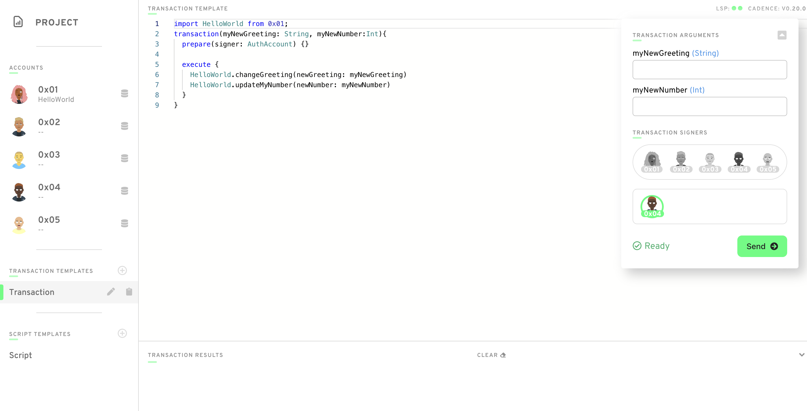
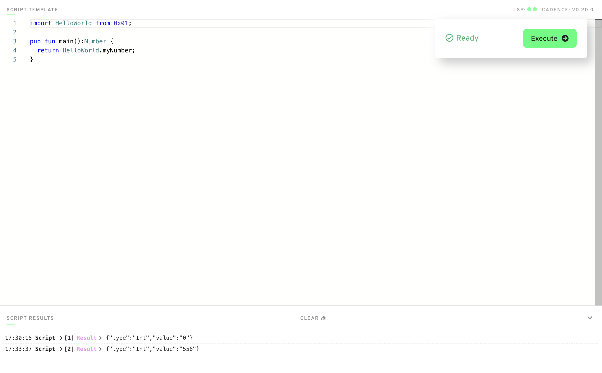

<hr/>

## Chapter 2 day 3 quests

1. In a script, initialize an array (that has length == 3) of your favourite people, represented as Strings, and log it.

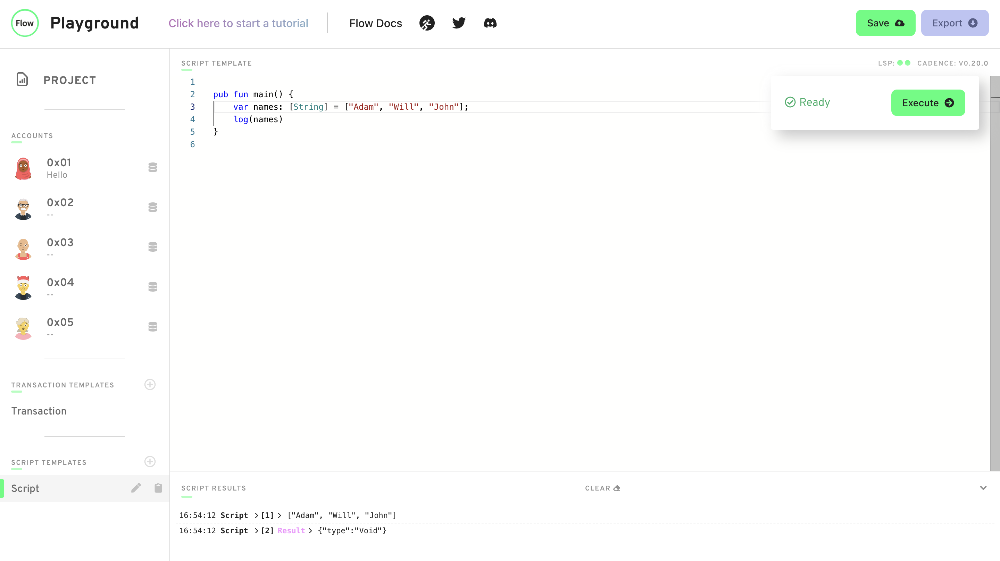

2. Explain what the force unwrap operator ! does, with an example different from the one I showed you (you can just change the type).

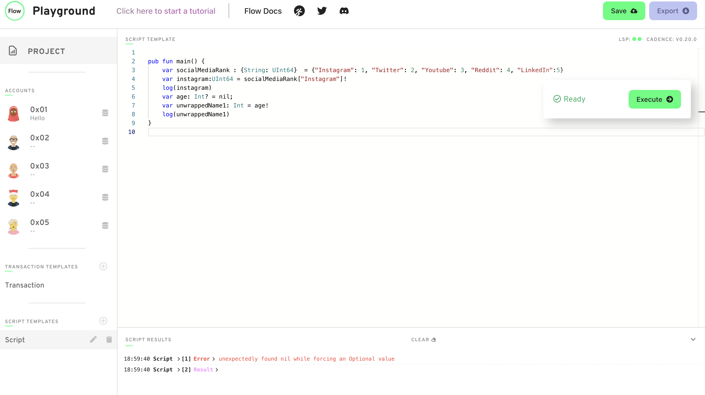

3. Explain what the force unwrap operator `!` does, with an example different from the one I showed you (you can just change the type).


1. Using this picture below, explain...
   - What the error message means
   - Why we're getting this error
   - How to fix it


- Error message means the function was expecting a `String` as a return type but got string? 'String or nil'
- We are getting this error because the return type does not match expected return type which is `String` does not match the actual return value type which is `String?`
- We can fix it in two way either by using the `force unwrap operator` or by setting the expected return type of the function as optional string `String?`

<hr/>

## Chapter 2 day 3 quests

1. Deploy a new contract that has a Struct of your choosing inside of it (must be different than `Profile`).

   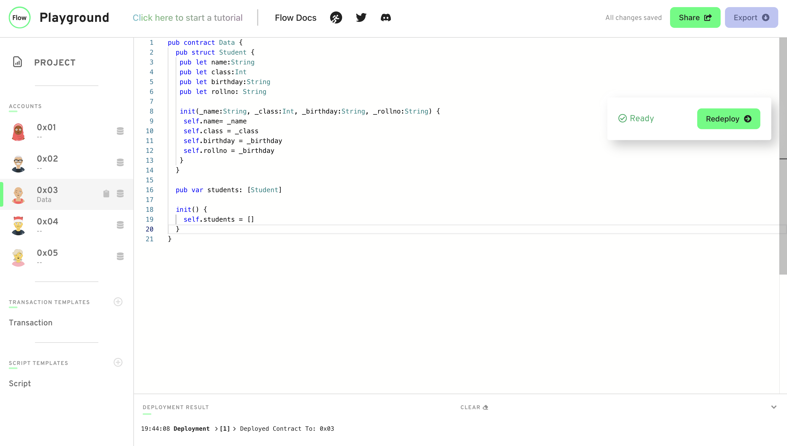

2. Create a dictionary or array that contains the Struct you defined.
   

3. Create a function to add to that array/dictionary.
   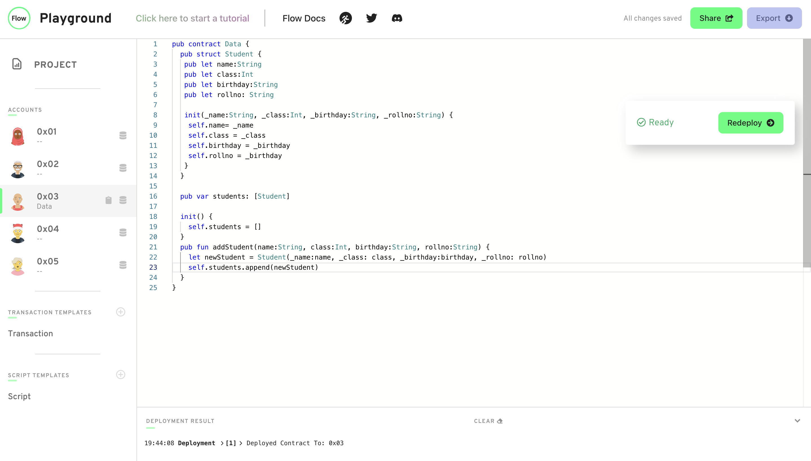

4. Add a transaction to call that function in step 3.
   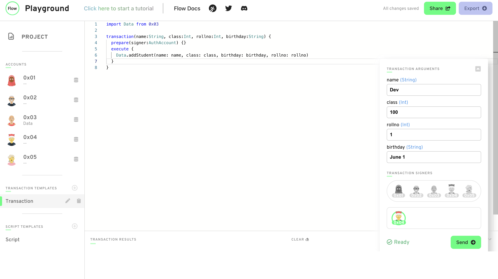

5. Add a script to read the Struct you defined.
   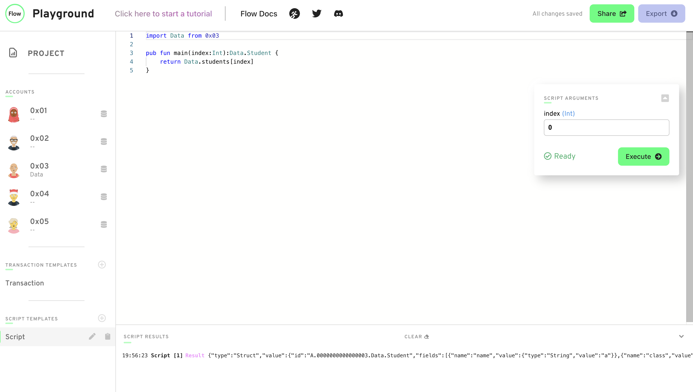

<hr/>

## Chapter 3 day 1 quests

1. In words, list 3 reasons why structs are different from resources.

   - Resources can not be copied while structs can be copied
   - Resources are very secure
   - Resources are very hard to loose
   - we need to use `<-` operator to move the resource
   - Resource can only be created inside a contract

2. Describe a situation where a resource might be better to use than a struct.

When the data security is really important, loosing the data is not an option and we don't want anyone coping our data `resource` should be use instead of `struct`.

3. What is the keyword to make a new resource?

`create`

4. Can a resource be created in a script or transaction (assuming there isn't a public function to create one)?

   No, we can only create a `resource` inside a contract.

5. What is the type of the resource below?

```javascript
pub resource Jacob {

}
```

`@Jacob`

6. Let's play the "I Spy" game from when we were kids. I Spy 4 things wrong with this code. Please fix them.

```javascript
pub contract Test {

    // Hint: There's nothing wrong here ;)
    pub resource Jacob {
        pub let rocks: Bool
        init() {
            self.rocks = true
        }
    }

    pub fun createJacob(): Jacob { // there is 1 here
        let myJacob = Jacob() // there are 2 here
        return myJacob // there is 1 here
    }
}
```

Fix

```javascript
pub contract Test {

    pub resource Jacob {
        pub let rocks: Bool
        init() {
            self.rocks = true
        }
    }

    pub fun createJacob(): @Jacob {
        let myJacob <- create Jacob()
        return <- myJacob
    }
}
```

<hr/>

## Chapter 3 day 2 quests

1. Write your own smart contract that contains two state variables: an array of resources, and a dictionary of resources. Add functions to remove and add to each of them. They must be different from the examples above.

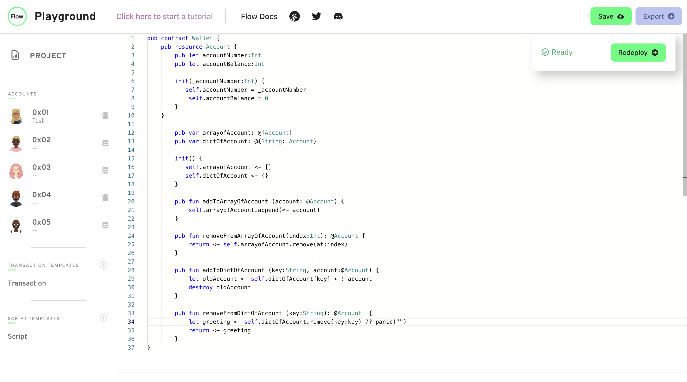

<hr/>

## Chapter 3 day 3 quests

1. Define your own contract that stores a dictionary of resources. Add a function to get a reference to one of the resources in the dictionary.
   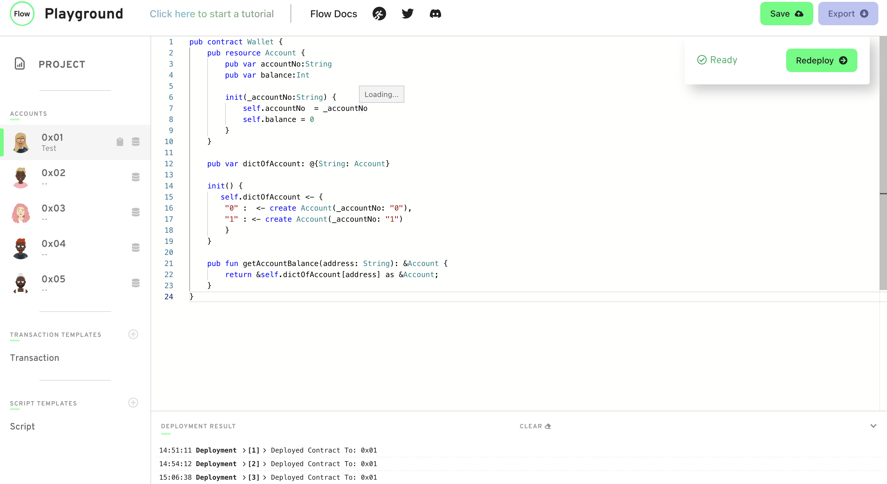

2. Create a script that reads information from that resource using the reference from the function you defined in part 1.
   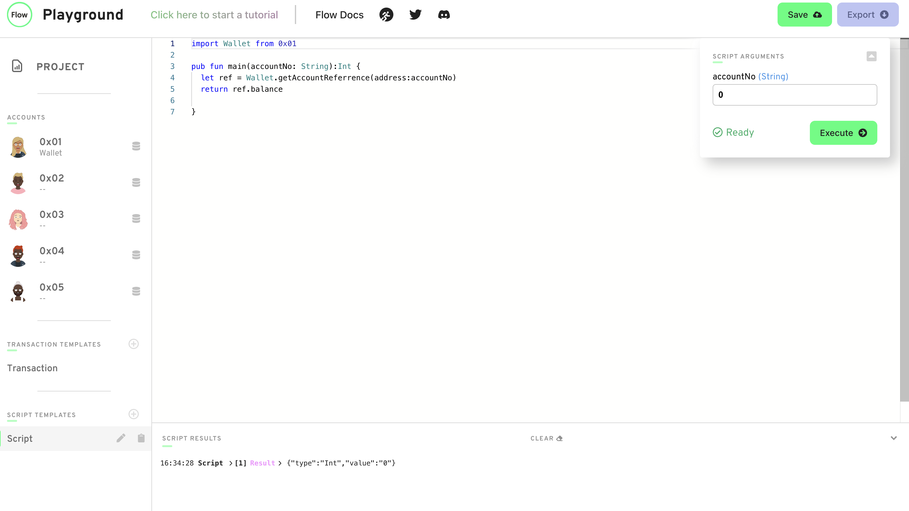

3. Explain, in your own words, why references can be useful in Cadence.
   - moving a `resource` can be expensive when we just want to edit it and `references` gives us a way to edit `resource` without moving it.

<hr/>

## Chapter 3 day 4

1. Explain, in your own words, the 2 things resource interfaces can be used for (we went over both in today's content)

- `Resource interfaces` can be used:
  - As set of requirement to implement a interface
  - To only expose certain things(link data or method) to certain people

1. Define your own contract. Make your own resource interface and a resource that implements the interface. Create 2 functions. In the 1st function, show an example of not restricting the type of the resource and accessing its content. In the 2nd function, show an example of restricting the type of the resource and NOT being able to access its content.

  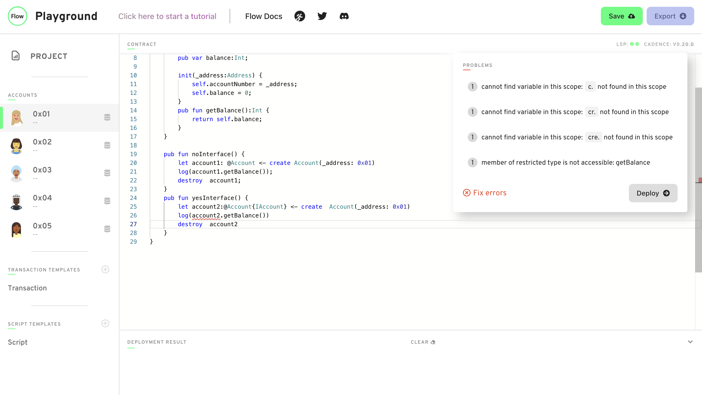

2. How would we fix this code?

```javascript
pub contract Stuff {

    pub struct interface ITest {
      pub var greeting: String
      pub var favouriteFruit: String
    }

    // ERROR:
    // `structure Stuff.Test does not conform
    // to structure interface Stuff.ITest`
    pub struct Test: ITest {
      pub var greeting: String

      pub fun changeGreeting(newGreeting: String): String {
        self.greeting = newGreeting
        return self.greeting // returns the new greeting
      }

      init() {
        self.greeting = "Hello!"
      }
    }

    pub fun fixThis() {
      let test: Test{ITest} = Test()
      let newGreeting = test.changeGreeting(newGreeting: "Bonjour!") // ERROR HERE: `member of restricted type is not accessible: changeGreeting`
      log(newGreeting)
    }
}
```

Fix:

```javascript
pub contract Stuff {

    pub struct interface ITest {
      pub var greeting: String
      pub var favouriteFruit: String

      pub fun changeGreeting(newGreeting:String):String;
    }

    // ERROR:
    // `structure Stuff.Test does not conform
    // to structure interface Stuff.ITest`
    pub struct Test: ITest {
      pub var greeting: String
      pub var favouriteFruit:String

      pub fun changeGreeting(newGreeting: String): String {
        self.greeting = newGreeting
        return self.greeting // returns the new greeting
      }

      init() {
        self.greeting = "Hello!"
        self.favouriteFruit = "Mango"

      }
    }

    pub fun fixThis() {
      let test: Test{ITest} = Test()
      let newGreeting = test.changeGreeting(newGreeting: "Bonjour!") // ERROR HERE: `member of restricted type is not accessible: changeGreeting`
      log(newGreeting)
    }
}
```

<hr/>

## Chapter3day5

For today's quest, you will be looking at a contract and a script. You will be looking at 4 variables (a, b, c, d) and 3 functions (publicFunc, contractFunc, privateFunc) defined in `SomeContract`. In each AREA (1, 2, 3, and 4), I want you to do the following: for each variable (a, b, c, and d), tell me in which areas they can be read (read scope) and which areas they can be modified (write scope). For each function (publicFunc, contractFunc, and privateFunc), simply tell me where they can be called.

```javascript
access(all) contract SomeContract {
    pub var testStruct: SomeStruct

    pub struct SomeStruct {

        //
        // 4 Variables
        //

        pub(set) var a: String

        pub var b: String

        access(contract) var c: String

        access(self) var d: String

        //
        // 3 Functions
        //

        pub fun publicFunc() {}

        access(contract) fun contractFunc() {}

        access(self) fun privateFunc() {}


        pub fun structFunc() {
            /**************/
            /*** AREA 1 ***/
            /**************/
        }

        init() {
            self.a = "a"
            self.b = "b"
            self.c = "c"
            self.d = "d"
        }
    }

    pub resource SomeResource {
        pub var e: Int

        pub fun resourceFunc() {
            /**************/
            /*** AREA 2 ***/
            /**************/
        }

        init() {
            self.e = 17
        }
    }

    pub fun createSomeResource(): @SomeResource {
        return <- create SomeResource()
    }

    pub fun questsAreFun() {
        /**************/
        /*** AREA 3 ****/
        /**************/
    }

    init() {
        self.testStruct = SomeStruct()
    }
}
```

This is a script that imports the contract above:

```javascript
import SomeContract from 0x01

pub fun main() {
  /**************/
  /*** AREA 4 ***/
  /**************/
}
```

1 - Inner
2 - Neighbor
3 - Containing
4 - Script

- For a: pub(set):
  - Read Access:
    - 1,2, 3, 4
  - Write Access:
    - 1,2, 3, 4
- For b: pub:
  - Read Access:
    - 1, 2, 3, 4
  - Write Access:
    - 1
- For c: access(contract):
  - Read Access:
    - 1,3
  - Write Access:
    - 1
- For d: access(self):
  - Read Access:
    - 1
  - Write Access:
    - 1
- For publicFunc: (pub):
  - Read Access:
    - 1,2, 3, 4
- For contractFunc:
  - Read Access:
    - 1, 3
- For privateFunc:
  - Read Access:
    - 1
